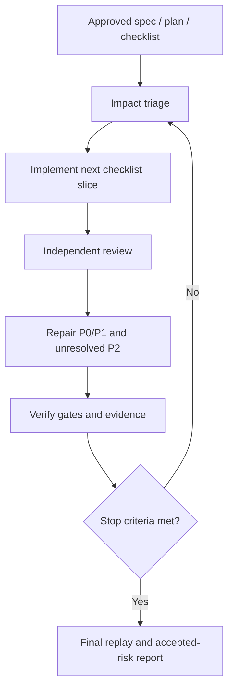

# Agentic Loop

A portable Codex App skill for running approved plans as implementation-first
bounded loops:

1. implement from an approved spec, plan, and checklist;
2. review with independent subagent roles;
3. repair all P0/P1 findings and unresolved P2 findings;
4. verify with evidence;
5. replay the plan point by point before stopping.

The reusable skill is project-agnostic. Each target repository should also keep a
project-local root `AGENTIC_LOOP.md` runbook with its own architecture rules,
verification commands, live gates, and accepted-risk policy.

## Repository Layout

```text
.
├── README.md
├── LICENSE
├── package.json
├── scripts/
│   ├── install-macos.sh
│   ├── install-windows.ps1
│   └── validate-skill.mjs
└── skills/
    └── agentic-loop/
        ├── SKILL.md
        ├── agents/openai.yaml
        ├── references/
        │   ├── bootstrap-guide.md
        │   ├── loop-protocol.md
        │   ├── project-runbook-template.md
        │   └── reviewer-prompts.md
        └── scripts/
            ├── build-traceability-index.mjs
            ├── bootstrap-project-runbook.mjs
            ├── draft-context-packet.mjs
            └── validate-loop-state.mjs
```

## Requirements

- Codex App with skills support.
- Node.js 20 or newer for validation and helper scripts.
- macOS shell or Windows PowerShell for the local installers.

## Quick Start

1. Install the skill with the platform script below.
2. Restart Codex App so it reloads installed skills.
3. In a project chat, run `$agentic-loop bootstrap this project` if the project
   does not already have `AGENTIC_LOOP.md`.
4. Run `$agentic-loop` with the approved spec, plan, checklist, and evidence
   paths.



## Install In Codex App On macOS

From this repository root:

```bash
./scripts/install-macos.sh --copy --force
```

Use `--symlink` for local development when you want Codex to read the working
tree directly:

```bash
./scripts/install-macos.sh --symlink --force
```

## Install In Codex App On Windows

From this repository root in PowerShell or Windows Terminal:

```powershell
powershell.exe -NoProfile -ExecutionPolicy Bypass -File .\scripts\install-windows.ps1 -Copy -Force
```

If you already use PowerShell 7, this equivalent command is fine:

```powershell
pwsh -NoProfile -ExecutionPolicy Bypass -File .\scripts\install-windows.ps1 -Copy -Force
```

Use `-Symlink -Force` for local development. Windows may require Developer Mode
or an elevated PowerShell session for directory symlinks; use `-Copy` for the
ordinary install path.

The Windows installer intentionally uses PowerShell path APIs and `-LiteralPath`
for file operations so checked-out paths with spaces or special characters are
handled without string-built command invocations.

Both platform installers write to:

```text
$CODEX_HOME/skills/agentic-loop
```

If `CODEX_HOME` is not set, it defaults to:

```text
macOS:   $HOME/.codex
Windows: %USERPROFILE%\.codex
```

Restart Codex App after installing or updating the skill.

## Install From GitHub After Publishing

After publishing this repository, Codex can install the skill by path:

```bash
python3 "$HOME/.codex/skills/.system/skill-installer/scripts/install-skill-from-github.py" \
  --repo OWNER/REPO \
  --path skills/agentic-loop
```

Replace `OWNER/REPO` with the published repository.

## Local Scratch State

Loop runs may create `.agentic-loop/` in a target project for local context
packets, finding ledgers, verification matrices, traceability rows, and delta
review packets. These files are useful while the loop is active, but durable
project evidence should live in the plan/evidence documents.

Recommended project `.gitignore` entry:

```gitignore
.agentic-loop/
```

If those files were already tracked, remove them from the index once:

```bash
git rm --cached .agentic-loop/*.md
```

## Usage

Activation is opt-in only. The skill should run only when the user explicitly
invokes `$agentic-loop`, names the `agentic-loop` skill, or directly asks to run
or bootstrap the agentic loop. It should not auto-start for ordinary review,
planning, implementation, or checklist requests.

When loop mode starts, the skill expects a root `AGENTIC_LOOP.md`. If it is
missing, the agent should bootstrap it automatically before running the loop.
When `ARCHITECTURE.md` or `docs/ARCHITECTURE.md` exists, bootstrap and context
packet helpers include a compact Architecture Orientation so the owning agent
and reviewers can navigate ownership, runtime, data-flow, and stack boundaries
without rereading the full architecture document every round.

Bootstrap a project-local runbook:

```text
$agentic-loop bootstrap this project
```

Run a bounded implementation loop with embedded review:

```text
$agentic-loop run the implementation loop for:
- SPEC_FILE: docs/123-feature-no-variant-spec.md
- PLAN_FILE: docs/124-feature-implementation-plan.md
- CHECKLIST_FILE: docs/125-feature-checklist.md
- EVIDENCE_FILE: docs/126-feature-evidence.md
Dispatch reviewer subagents according to Impact Triage.
Fix all P0/P1. Fix P2 or record accepted risk.
```

This is implementation-first. When `SPEC_FILE`, `PLAN_FILE`, and
`CHECKLIST_FILE` are supplied, the owning agent executes the next incomplete
checklist slice before broad review. Reviewers validate completed slices and
surface plan gaps; they do not become the owners of implementation scope.

Loop mode performs Impact Triage first, then picks review depth from risk:
small work gets at least one reviewer subagent after the first meaningful
change, medium work gets 2-3 reviewer subagents, and large or high-risk work
gets 4-6 reviewer subagents, batched when ownership or context size requires
it.

Reviewer subagents are treated as visible ephemeral workers: the owning agent
should spawn normal Codex App subagents so their names and active status remain
visible in the status panel, keep them open while they are actively running,
collect their result, then close them with `close_agent` after integration. The
loop must not create, promote, or preserve child-agent threads as durable
chat-history items.

Reviewers batch findings within their assigned scope: all P0/P1, P2 up to the
adaptive cap from Impact Triage, no P3 unless requested, and no stopping after
the first issue.

Fallback to self-review is allowed only when the subagent tool is unavailable,
the user disables subagents, or Impact Triage records that spawning a child
would be unsafe.

During loops the agent must emit exactly one Progress Beacon per review cycle as
a user-visible chat/commentary update after reviewer batches are deduplicated
and before repair starts. Evidence or `.agentic-loop` writes do not count as
beacons. Each beacon contains only severity counts, short problem classes, and
what will be repaired or verified next.

The loop keeps review cost bounded with compact reviewer context packets,
adaptive P2 caps, delta-only re-review after repairs, role fusion for medium
scope, and a finding ledger that lets the owning agent deduplicate reviewer
overlap without hiding independent evidence.

For medium and larger work, the loop records reusable state artifacts: reviewer
context packet, finding ledger, verification matrix, traceability matrix, and
delta review packet. These keep later review rounds focused on changed facts
instead of re-reading the whole plan and evidence history.

`.agentic-loop/` is intended as local loop scratch state. Keep durable project
evidence in the plan/evidence documents; ignore `.agentic-loop/` by default
unless a repository explicitly decides to version a loop snapshot.

Additional token controls:

- use one runtime protocol per loop, preferring project `AGENTIC_LOOP.md`;
- keep a rolling `Current State` at the top of evidence;
- use stable plan/checklist IDs and short item hashes in traceability rows;
- keep reusable state in `.agentic-loop/context.md`,
  `.agentic-loop/findings.md`, `.agentic-loop/verification.md`,
  `.agentic-loop/traceability.md`, and `.agentic-loop/delta.md` when evidence
  would otherwise grow large;
- use one runtime protocol: project `AGENTIC_LOOP.md` for normal loops, global
  `loop-protocol.md` only for bootstrap/update/debug;
- require reviewer read mode and `Extra files read`;
- summarize command output and link full logs/artifacts instead of pasting them.

Draft a context packet from repository state:

```bash
node skills/agentic-loop/scripts/draft-context-packet.mjs \
  --project /path/to/project \
  --evidence /path/to/project/docs/evidence.md \
  --max-lines 80 \
  --max-files 40 \
  --include apps/web \
  --architecture-file ARCHITECTURE.md \
  --scope "provider settings slice" \
  --command "npm test: passed" \
  --known-failure "live Plane gate not run"
```

Build traceability IDs and hashes:

```bash
node skills/agentic-loop/scripts/build-traceability-index.mjs \
  --plan /path/to/plan.md \
  --checklist /path/to/checklist.md \
  --existing /path/to/project/.agentic-loop/traceability.md \
  --section "provider settings" \
  --status TODO,gap_found
```

Show only changed/new/removed traceability rows:

```bash
node skills/agentic-loop/scripts/build-traceability-index.mjs \
  --plan /path/to/plan.md \
  --checklist /path/to/checklist.md \
  --existing /path/to/project/.agentic-loop/traceability.md \
  --changed-only
```

Use `--include-headings` only when headings are actionable plan/checklist items.
Use `--ids PLAN-001,CHK-004` for targeted replay rows.
Generate a full standalone project runbook with `--self-contained`; default
bootstrap output is compact and assumes the global skill is installed. Add
`--include-all-scripts` only when the full root script list belongs in the
project runbook.

Validate evidence loop state:

```bash
node skills/agentic-loop/scripts/validate-loop-state.mjs \
  --evidence /path/to/evidence.md
```

The skill intentionally separates two layers:

- global method: this repository;
- project contract: generated and then maintained inside each target project.

## Bootstrap Script

The skill includes a deterministic project scanner:

```bash
node skills/agentic-loop/scripts/bootstrap-project-runbook.mjs \
  --project /path/to/project
```

The script does not read `.env` files. It inspects project metadata, package
scripts, known config files, docs, and CI definitions, then creates a draft
runbook. Codex should refine that draft after reading the project architecture
and migration docs.

## Validation

Run:

```bash
npm run validate
```

This checks that the installable skill has the required structure and metadata.
